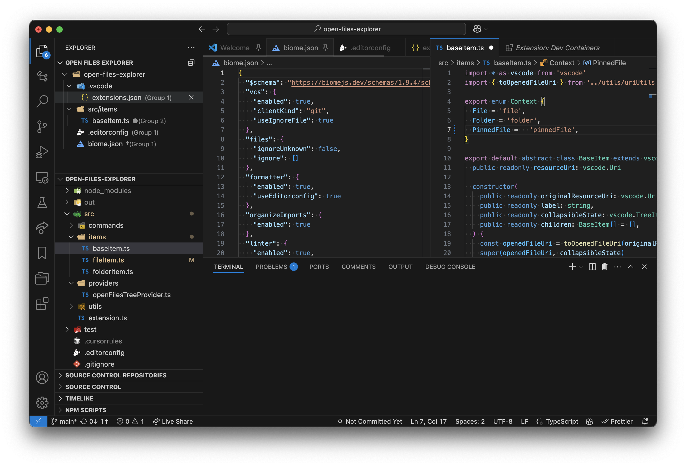

# Open Files Explorer

Open Files Explorerは、現在開いているファイルを階層化してフォルダごとに整理して表示する専用のツリービューを提供するVisual Studio Code拡張機能です。

## 機能

- **専用エクスプローラービュー**: 開いているすべてのファイルを一箇所で簡単に確認できます
- **フォルダ整理**: ファイルはワークスペースフォルダごとに整理されます
- **クイックアクション**: エクスプローラーから直接ファイルを閉じたり、エディターのピン留めを解除したりできます
- **ワークスペースサポート**: マルチルートワークスペースに対応しています

## 使い方

1. インストール後、エクスプローラーサイドバーに新しい「Open Files Explorer」ビューが表示されます
2. 開いているファイルはこのビューに自動的に表示され、フォルダごとに整理されます
3. コンテキストメニューまたはインラインボタンを使用して以下の操作ができます：
   - ファイルを閉じる
   - エディターのピン留めを解除する
   - フォルダ内のすべてのエディターを閉じる

## コマンド

この拡張機能は以下のコマンドを提供します：

- **閉じる**: 選択したファイルを閉じます
- **エディターの固定を解除する**: ピン留めされたエディターのピン留めを解除します
- **フォルダ内のすべてのエディタを閉じる**: 選択したフォルダ内のピン留めされていないすべてのエディターを閉じます

## 要件

- Visual Studio Code バージョン 1.96.0 以上

## 拡張機能の設定

この拡張機能は現在のところ設定項目はありません。

## 既知の問題

現時点では特にありません。問題が発生した場合は、[GitHubリポジトリ](https://github.com/shouki-s/open-files-explorer/issues)に報告してください。

## 貢献

貢献は歓迎します！お気軽にプルリクエストを送信してください。

## ライセンス

この拡張機能は[MITライセンス](LICENSE)の下でライセンスされています。
