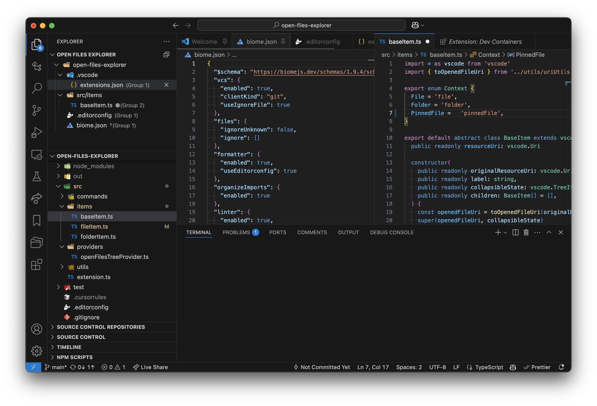

# Open Files Explorer

Open Files Explorer is a Visual Studio Code extension that provides a dedicated explorer view for your currently open files, organized by workspace folder.

## Features

- **Dedicated Explorer View**: Easily see all your open files in one place
- **Folder Organization**: Files are organized by their workspace folder
- **Quick Actions**: Close files or unpin editors directly from the explorer
- **Workspace Support**: Works with multi-root workspaces

## Usage

1. After installation, you'll see a new "Open Files Explorer" view in the Explorer sidebar
2. Open files will be automatically displayed in this view, organized by folder
3. Use the context menu or inline buttons to:
   - Close a file
   - Unpin an editor
   - Close all editors in a folder

## Commands

The extension provides the following commands:

- **Close**: Close the selected file
- **Unpin Editor**: Remove the pin from a pinned editor
- **Close All Editors in Folder**: Close all unpinned editors in the selected folder

## Requirements

- Visual Studio Code version 1.97.0 or higher

## Extension Settings

This extension does not add any settings yet.

## Known Issues

None at this time. If you encounter any issues, please report them on the [GitHub repository](https://github.com/shouki-s/open-files-explorer/issues).

## Release Notes

### 0.0.1

- Initial release
- Basic functionality for viewing open files by folder
- Actions to close files, unpin editors, and close folders

## Contributing

Contributions are welcome! Please feel free to submit a Pull Request.

## License

This extension is licensed under the [MIT License](LICENSE).
